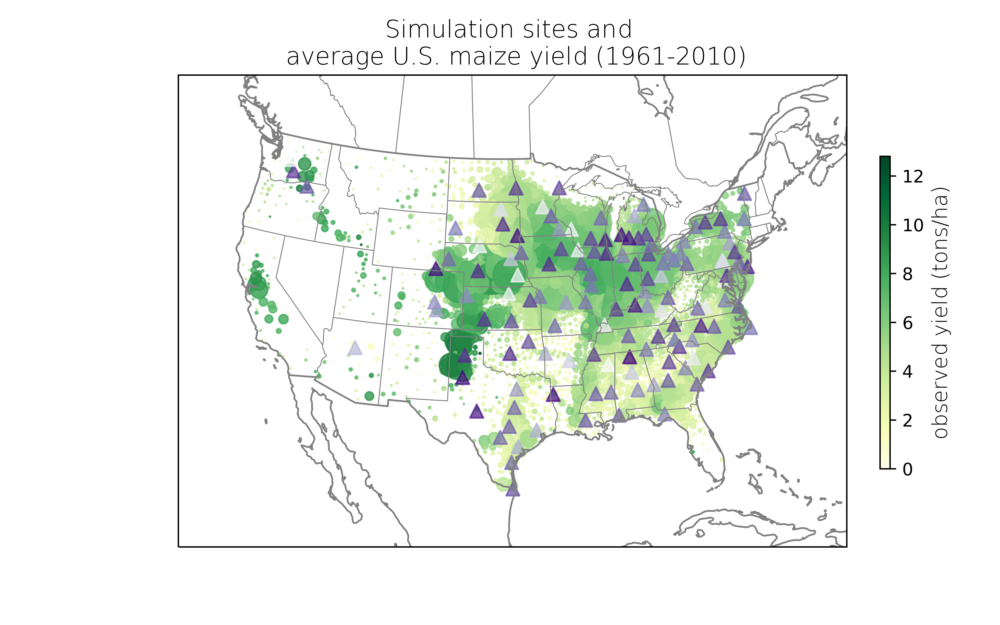

# Ideotype

## Motivation
Over the next three decades rising population and changing dietary preferences are expected to increase food demand by 25–75%. At the same time climate is also changing — with potentially drastic impacts on food production. Changes in *__crop characteristics__* and *__management practices__* have the potential to mitigate some of the expected decrease in yield due to a changing climate. However, a substantial knowledge gap remains for which of these adaptation techniques are likely to be most effective at any point in time, the mechanisms through which they can mitigate yield loss, and the relative effectiveness of different approaches. 

We use a process-based crop simulation model (MAIZSIM) to explore how different crop traits and agricultural management options affect maize growth and yield, with the hope to identify ideal trait and management combinations, known as *__ideotypes__*, that maximize yield and minimize risk for different agro-climate regions in the US.

## Approach
### Identify key crop trait and management
*Parameter selection:*
We selected several key model parameters that describe physiological, morphology, and phenological traits within a maize plant, as well as management practices such as planting dates and planting density. We set biologically reasonable ranges for the parameters and sampled within the boundaries following the Latin hypercube sampling method to create ensemble simulations of 1000 different parameter combinations.

*Sensitivity analysis:*
We use a sensitivity analysis framework to identify critical parameters in the MAIZSIM model through two complementary methods - by calculating the partial correlation coefficient (PCC), and by performing the Fourier amplitude sensitivity test (FAST). 

### Identify trait-management combinations with high yield and low volatility
By calculating mean yield over years normalized by yield variance over years due to natural climate variability, we identify key trait-management combinations that lead to high yield and low yield volatility for different maize-growing resgions within the US.

### Ideotype under current vs. future climate
We ran the MAIZSIM model with past climate as well as idealized projections of 2050 future climate to identify how ideotypes may shift with a changing climate. 

## Simulation sites

  

